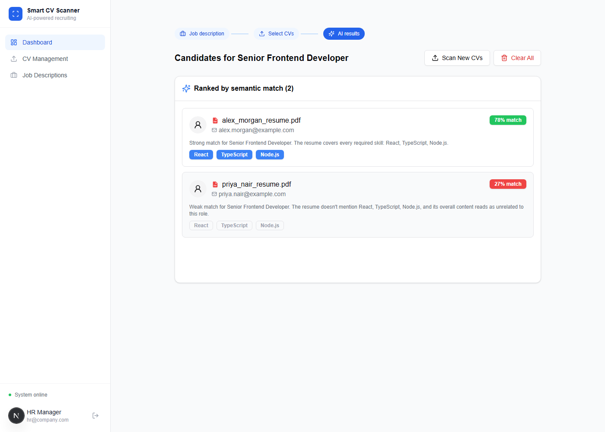
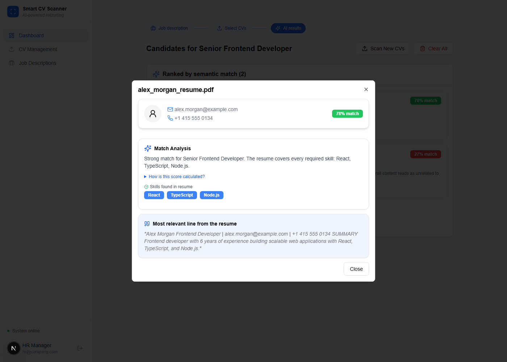

# Smart CV Scanner

A recruiting dashboard that ranks candidate resumes against a job description using **semantic similarity** — not keyword matching. Upload real PDF resumes, and each one gets a genuine match score computed from sentence embeddings, plus a breakdown of which required skills were actually found in the resume text.

Demo Link: https://hiring-app-hazel.vercel.app/

**LOGIN CREDENTIALS**

USERNAME: admin
PASSWORD: password

## How the matching works



1. **Upload** — a PDF resume is parsed entirely in the browser with `pdfjs-dist`; its raw text is extracted, no server upload of the file itself is needed.
2. **Embed** — the job description (title, responsibilities, qualifications, required skills) and each resume's text are embedded with `sentence-transformers/all-MiniLM-L6-v2`, run in a Next.js API route via `@xenova/transformers`.
3. **Score** — the cosine similarity between the job embedding and each resume embedding produces the match percentage. This is a real, computed number — not a random or hardcoded value.
4. **Explain** — the score is turned into a plain-language verdict ("Strong match... the resume covers React, TypeScript, Node.js" / "Weak match... doesn't mention X, Y, Z"), backed by simple keyword matching against the required skills and the single most relevant sentence pulled from the resume as evidence. The technical detail (model name, cosine similarity) is tucked into a collapsible note instead of being the headline.



In the screenshots above, a frontend-developer resume scores **78%** against a "Senior Frontend Developer (React, TypeScript, Node.js)" posting, while an unrelated data-engineer resume scores **27%** against the same posting — the ranking reflects genuine semantic relevance.

## Honest scope

This is applied NLP/embeddings, not a custom-trained model — the same technique production hiring tools use for candidate-job matching. The similarity score is a relative relevance signal for ranking candidates, not a calibrated pass/fail probability.

## Features

- Real PDF text extraction (client-side, no file upload to a server)
- Embedding-based semantic match scoring (`all-MiniLM-L6-v2`, cosine similarity)
- Skill-level match/gap breakdown per candidate
- Plain-language match verdict, not just a bare percentage
- Evidence snippet: the most relevant line pulled straight from the resume
- Job description CRUD (create, edit, delete postings)
- CV library with upload, search, and management
- A step indicator ties Job description → Select CVs → AI results into one visible flow
- Minimal light UI built with shadcn/ui, Tailwind, and Framer Motion

## Tech Stack

**Frontend:** Next.js 15, React 19, TypeScript, Tailwind CSS, shadcn/ui (Radix), Framer Motion
**PDF parsing:** pdfjs-dist (client-side)
**Embeddings:** @xenova/transformers running `sentence-transformers/all-MiniLM-L6-v2` in a Next.js API route (`app/api/analyze-match`)

## Project Structure

```
Hiring-App/
├── app/
│   ├── dashboard/          # tab-based dashboard (upload, jobs, candidates)
│   ├── new-job/            # job posting form
│   ├── scan-cv/            # CV scanner + results UI
│   └── api/
│       └── analyze-match/  # embeds job + resumes, returns ranked scores
├── components/
│   ├── UploadCV.tsx        # PDF upload + client-side text extraction
│   ├── JobDescriptions.tsx
│   └── ui/                 # shadcn/ui components
└── lib/
    └── pdf.ts              # browser-side PDF text extraction helper
```

## Getting Started

```bash
npm install
npm run dev
```

Open [http://localhost:3000](http://localhost:3000). Log in with the demo credentials above, upload a PDF resume from **CV Management**, create or pick a job posting, then **Scan CV** to see real semantic match scores.

> The embedding model loads on the first API call and is cached in memory afterward — the first scan of a session is slower than the rest.

## Author

**Syed Hamza Ali** — [GitHub](https://github.com/SyedHamza-Dev)
